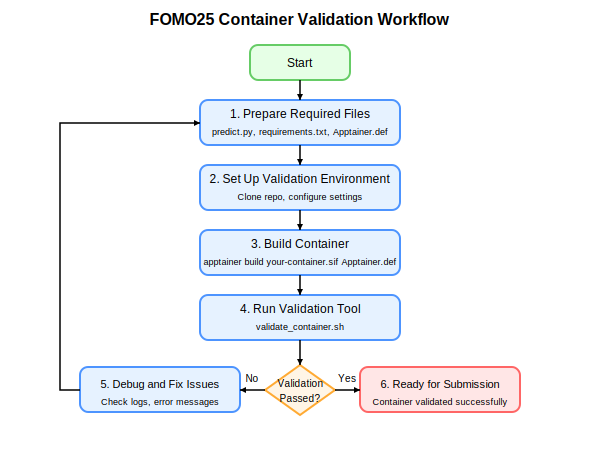

# FOMO25 Challenge Container Validation

This repository contains the official container validation tool for the FOMO25 Challenge, which investigates the few-shot generalization properties of foundation models for brain MRI data analysis.

Please note: This repository will be continually refined, so check back occasionally to get the latest updates.

## Table of Contents
- [Overview](#overview)
- [How to Make a Correct Submission](#how-to-make-a-correct-submission)
  - [1. Required Files](#1-required-files)
    - [predict.py](#predictpy)
    - [requirements.txt](#requirementstxt)
    - [Apptainer.def](#apptainerdef)
  - [2. Install Apptainer](#2-install-apptainer)
  - [3. Integrate Validation with Your Project](#integrating-validation-with-your-project)
  - [4. Build Your Container](#4-build-your-container)
  - [5. Run Validation](#5-run-validation)
- [FAQ](#faq)


## Overview

The FOMO25 Challenge requires participants to submit their models as containerized solutions. This containerization approach ensures that your model can run in the evaluation environment exactly as it does on your own system, with all dependencies properly packaged. The container creates a standardized, isolated environment where your model can operate regardless of the host system configuration.

This repository provides a validation tool that performs a critical "sanity check" on your container before official submission. The purpose of this validation is not to evaluate how well your model performs, but rather to verify that it meets the technical requirements needed for proper execution in the challenge environment. Many submissions are rejected due to technical issues that could have been caught beforehand, wasting valuable time and effort.

The validation specifically checks:

- Container structure and the presence of required files.
- Execution permissions and script functionality.
- Proper handling of input/output paths and NIfTI medical image files.
- Container's ability to run in the expected environment.

By running this validation locally, you can identify and fix technical issues early, ensuring your submission can be properly evaluated on its scientific merits rather than being rejected due to implementation problems.


## Validation Workflow

The validation process follows this general workflow:

1. You prepare the required files for your container
2. You set up the validation environment
3. You build your container
4. You run the validation tool against your container
5. If validation fails, you debug and fix issues
6. When validation passes, your container is ready for submission


<div align="center">
  
</div>

## Install Apptainer

you need to install Apptainer on your computer (formerly Singularity) to build and run your container. Apptainer primarily supports Linux environments (Ubuntu, Debian, etc). If using MacOS or Windows, you'll need to use virtualization tools (Docker, Virtual Machines or wsl2). You can find the installation instructions in the [official Apptainer documentation](https://apptainer.org/docs/admin/main/installation.html).

- [Install in Linux (Ubuntu, Debian, Fedora, ...)](https://apptainer.org/docs/admin/main/installation.html#install-from-pre-built-packages)
- [Install in MacOS](https://apptainer.org/docs/admin/main/installation.html#mac)
- [Install in Windows](https://apptainer.org/docs/admin/main/installation.html#windows)

You can verify your Apptainer installation with the following command:

```bash
apptainer --version
```


## How to Make a Correct Submission (Step-by-Step)

### 1. Required Files

You will need the following files:
- A `predict.py` to make inference
- A `requirements.txt` with the necessary dependencies
- An `Apptainer.def` file

Additionally, you must have the following libraries installed in your environment to generate synthetic data that will be used to test your model and to calculate metrics on the outputs after inference (outside the container).

```
nibabel
numpy
json
pandas
scikit-learn
tqdm
concurrent
```

#### predict.py

`predict.py` handles inference operations with your trained model. This script processes NIfTI files and it has to preserve the original image metadata in the output.

**Command Structure**

The predict.py file must accept the following arguments:
- `--input`: Path to the input file for inference
- `--output`: Destination path for saving results

Here is an example of usage: 

```bash
python predict.py --input /path/to/input/file.nii.gz --output /path/to/output/file.nii.gz
```

**Implementation Template**

```python
import argparse
import os
import nibabel as nib
import numpy as np

def parse_args():
    parser = argparse.ArgumentParser(description="FOMO25 Inference CLI")
    parser.add_argument("--input", type=str, required=True, help="Path to input NIfTI file")
    parser.add_argument("--output", type=str, required=True, help="Path to save output prediction file")
    return parser.parse_args()

def main():
    args = parse_args()
    
    # Load input image
    input_img = nib.load(args.input)
    input_data = input_img.get_fdata()
    
    # Your model inference code here
    # For this example, create a dummy segmentation
    output_data = np.zeros_like(input_data)
    
    # Save with same metadata as input
    output_img = nib.Nifti1Image(output_data, input_img.affine, input_img.header)
    nib.save(output_img, args.output)
    return 0

if __name__ == "__main__":
    main()
```

#### requirements.txt

The `requirements.txt` file lists all necessary Python packages required for your model inference, ensuring consistent environment configuration.

**Implementation Template**

```
torch
nibabel
numpy
```
Note: This is an example. Put your own dependencies here.

#### Apptainer.def

The `Apptainer.def` file contains instructions for building your container environment, ensuring reproducibility and portability.

**Implementation Template**
```apptainer
Bootstrap: docker
From: pytorch/pytorch:2.0.0-cuda11.7-cudnn8-runtime

%files
    src /app
    requirements.txt /app/requirements.txt

%post
    apt-get update && apt-get install -y --no-install-recommends \
        python3-pip \
        python3-dev \
        && rm -rf /var/lib/apt/lists/*
    
    pip install --no-cache-dir -r /app/requirements.txt
    
    # Make predict.py executable
    chmod +x /app/predict.py

%runscript
    exec python /app/predict.py "$@"
```


### 4. Integrating Validation with Your Project

#### Validation Components
The validation tool includes the following key components that will be used to test your container:

- `validate_container.sh`: Main validation script that orchestrates the testing process
- `compute_metrics.py`: Calculates performance metrics on your model's output
- `test_data_generator.py`: Creates synthetic NIfTI test images for validation

You don't need to modify these files, but understanding their purpose helps troubleshoot any validation issues.


#### Directory Structure
Set up your project with the following recommended structure to easily integrate the validation tool:

```
your-project/
├── src/                  # Your model code and implementation
│   ├── predict.py        # Main inference script (will be copied to container)
│   └── ...               # Other model files
├── requirements.txt      # Dependencies for your model
├── Apptainer.def         # Container definition file
├── validation/           # Validation tool directory (clone from this repo)
│   ├── validate_container.sh
│   ├── compute_metrics.py
│   ├── test_data_generator.py
│   └── ...
├── test/                 # Default directories for validation data
│   ├── input/            # Test inputs (empty, will be populated during validation)
│   └── output/           # Test outputs (empty, will be populated during validation)
└── container_config.yml  # Validation configuration
```

#### Installation Steps

1. **Clone the validation repository into your project**

```bash 
git clone https://github.com/FOMO25-challenge/container-validation.git validation
```

2. **Copy configuration template**

```bash 
cp validation/container_config.template.yml ./container_config.yml
```

3. **Create necessary directories**

```bash 
mkdir -p test/input test/output
```

4. **Configure validation settings**
Edit container_config.yml to match your project's specific needs:

```yaml
# Container settings
container:
  name: "your-model-name"   # Give your container a meaningful name
  command: "apptainer"      # Use "apptainer" or "singularity" based on your installation

# Directory paths
directories:
  input: "test/input"       # Relative path to test input directory
  output: "test/output"     # Relative path to test output directory
  containers: "."           # Location where your container image is stored

# Validation settings
validate:
  gpu: true                 # Set to false if not using GPU for testing
  generate_data: true       # Creates synthetic test data
  compute_metrics: true     # Calculate performance metrics
  save_report: true         # Generate validation report
  result_file: "validation_result.json"  # Report output location
```


### 2. Build Your Container
Now you need to build the container (my-container.sif) using Apptainer.
The container is defined in the Apptainer.def file.

```apptainer
Bootstrap: docker
From: pytorch/pytorch:2.0.0-cuda11.7-cudnn8-runtime

%files
    # Here files are copied from your computer to the container
    src /app (copy the contents of the src directory to the /app directory)
    requirements.txt /app/requirements.txt (copy requirements file)

%post
    apt-get update && apt-get install -y --no-install-recommends \
        python3-pip \
        python3-dev \
        && rm -rf /var/lib/apt/lists/*
    
    # Install dependencies specified in the requirements.txt file
    pip install --no-cache-dir -r /app/requirements.txt
    
    # Make predict.py executable
    chmod +x /app/predict.py

%runscript
    # When launching the container, execute the /app/predict.py file
    exec python /app/predict.py "$@"
```


You must have the following folder structure inside the container. Your predict.py file must be located at the path /app/predict.py. You should also have two empty directories: input and output. The input directory will be mounted with the input data folder, and the output directory will store the inference results.  

```
/
├── app/              # Your application code
│   ├── predict.py    # Main inference script (REQUIRED)
│   └── ...           # Other necessary code
├── input/            # Mounted input directory (DO NOT include in container)
├── output/           # Mounted output directory (DO NOT include in container)
└── ...               # Other system files
```


To build the container, use the command:
```bash
apptainer build your-container.sif Apptainer.def
```
Required dependencies to consider:

nibabel (for medical image handling)
numpy (for array operations)
Your deep learning framework (PyTorch, TensorFlow, etc.)
Any additional packages your solution needs


### 3. Run Validation
(Aqui explicar que hay que tener la carpeta validation (con los archivos compute_metrics para calcular metricas sobre los datos de inferenciia y el fichero test_data generator que genera data sintetica que es utilizada a modo de prueba para hacer inferencia), el archivo de container_config.yml y )
Execute the validation script with your container:

**Configuration Options**

The `container_config.yml` file allows customizing the validation process:
```yaml
# Container settings
container:
  name: "your-container"   # Container name 
  command: "apptainer"     # Container command

# Directory paths
directories:
  input: "test/input"      # Input data location
  output: "test/output"    # Results location
  containers: "apptainer-images"  # Container storage location

# Validation settings
validate:
  gpu: true                # Use GPU if available
  generate_data: true      # Create synthetic test data
  compute_metrics: true    # Calculate performance metrics
  save_report: true        # Generate validation report
  result_file: "validation_result.json"  # Report output file
```
```bash
./validate_container.sh --path /path/to/your-container.sif
```

For custom configuration:
```bash
./validate_container.sh --config container_config.yml
```

**Common Validation Errors**:
- Missing predict.py: Ensure the script exists at `/app/predict.py`
- Permission denied: Make sure predict.py is executable
- Dependency errors: Check that all required packages are installed
- Input/output errors: Verify your script handles specified paths correctly

The validation generates a report in `validation_result.json` with detailed information.


## FAQ

**Q: Do I need to include training code in my submission?**  
A: No, only the inference code is required. The evaluation will only run your `predict.py` script.

**Q: Can I use frameworks other than PyTorch?**  
A: Yes, you can use any framework as long as it's included in your container. Make sure to specify all dependencies in your `Apptainer.def` file.

**Q: How do I handle GPU support?**  
A: The validation script will test GPU support if available. Include GPU-compatible versions of your libraries if your model uses GPU acceleration.

**Q: Can I test with my own data?**  
A: Yes, place your test data in the input directory defined in `container_config.yml`.